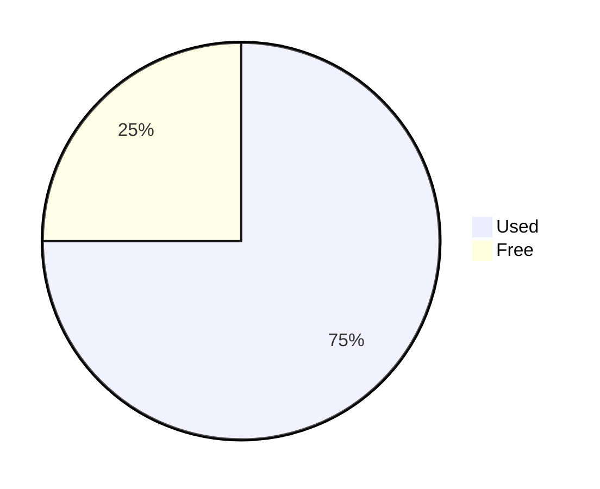

# mermaid_dart

A pure-Dart Mermaid parser and renderer with verified visual parity against
Mermaid.js 11.16.0 for every diagram type currently supported by this package.

`mermaid_dart` runs without a browser, DOM, or JavaScript runtime. It parses
Mermaid source into typed Dart ASTs, lays those ASTs out as a backend-neutral
scene graph, and can serialize the scene as accessible SVG.

## Status

The parity suite currently covers 73 representative diagrams. All 73 pass
visual comparison against the pinned Mermaid.js 11.16.0 renderer:

```text
Result: 0 exact, 73 visual, 0 different, 0 errors
```

“Visual parity” means the viewport, visible text, element counts, geometry, and
paint agree within the harness tolerances. Canonical SVG strings are not
expected to be identical: Mermaid.js emits browser-oriented wrappers and CSS,
while this package serializes resolved styles from a backend-neutral scene.

Parity applies to the supported diagram types below. It does not imply support
for every diagram family available in Mermaid.js.

## Supported diagrams

| Diagram | `DiagramType` | Typical Mermaid header |
| --- | --- | --- |
| Architecture | `architecture` | `architecture-beta` |
| Cynefin | `cynefin` | `cynefin-beta` |
| Event Modeling | `eventModeling` | `eventmodeling` |
| Flowchart | `flowchart` | `flowchart`, `graph` |
| Git Graph | `gitGraph` | `gitGraph` |
| Info | `info` | `info` |
| Packet | `packet` | `packet`, `packet-beta` |
| Pie | `pie` | `pie` |
| Radar | `radar` | `radar-beta` |
| Railroad | `railroad` | `railroad-beta` |
| Railroad ABNF | `railroadAbnf` | `railroad-abnf-beta` |
| Railroad EBNF | `railroadEbnf` | `railroad-ebnf-beta` |
| Railroad PEG | `railroadPeg` | `railroad-peg-beta` |
| Tree View | `treeView` | `treeView-beta` |
| Treemap | `treemap` | `treemap`, `treemap-beta` |
| Wardley Map | `wardley` | `wardley-beta` |

All four railroad syntaxes lower into the same typed `RailroadAst`, allowing
one layout implementation to render Railroad, ABNF, EBNF, and PEG input.

## Quick start

Import the package and render Mermaid source directly to SVG:

```dart
import 'package:mermaid_dart/mermaid_dart.dart';

void main() {
  final svg = renderDiagramSvg(
    DiagramType.pie,
    '''
pie showData
title Storage
"Used": 75
"Free": 25
''',
  );

  print(svg);
}
```

`renderDiagramSvg` is the convenience API for the complete pipeline:

```text
Mermaid source → typed AST → DiagramScene → SVG
```

## Parse, inspect, and render separately

Use the individual stages when you need to inspect the AST, customize layout,
or render the same scene through another backend:

```dart
import 'package:mermaid_dart/mermaid_dart.dart';

void main() {
  final ast = parse(
    DiagramType.packet,
    '''
packet-beta
0-7: "Source"
8-15: "Destination"
+16: "Payload"
''',
  );

  final scene = layoutDiagram(
    ast,
    options: const RenderOptions(padding: 12),
  );

  final svg = renderSvg(
    scene,
    options: const SvgRenderOptions(
      pretty: true,
      rootId: 'packet-diagram',
      widthMode: SvgWidthMode.fitContainer,
    ),
  );

  print(svg);
}
```

The resulting `DiagramScene` contains absolute geometry, bounds, paths,
transforms, resolved paint and text styles, stable element IDs, semantic roles,
clip paths, viewport policy, and accessibility metadata. It is intentionally
independent of SVG so it can also be consumed by custom drawing backends.

## Flutter Canvas rendering

The companion package in
[`packages/mermaid_dart_flutter`](packages/mermaid_dart_flutter) paints a
`DiagramScene` directly with Flutter `Canvas`, `Paint`, `Path`, and
`TextPainter`; it does not create SVG. Keeping the adapter in a separate
package means `mermaid_dart` itself remains usable in Dart-only environments.

```dart
import 'package:flutter/widgets.dart';
import 'package:mermaid_dart/mermaid_dart.dart';
import 'package:mermaid_dart_flutter/mermaid_dart_flutter.dart';

const diagram = MermaidDiagram(
  diagramType: DiagramType.pie,
  source: '''
pie
title Pets
  "Dogs": 60
  "Cats": 40
''',
);
```

Choose the Flutter API based on where your application enters the pipeline:

- `MermaidDiagram` accepts source and performs parsing, layout, and painting.
- `MermaidSceneView` displays a scene that the application parsed, configured,
  or cached itself.
- `MermaidScenePainter` provides direct `CustomPaint` sizing, alignment, and
  composition control.

Constructing the scene yourself is useful for handling parse errors outside the
widget build, inspecting the typed AST, caching layout, injecting render options
or icons, and sharing one scene between Flutter and SVG output. Use
`FlutterTextMeasurer` during that layout so text geometry matches Flutter's
`TextPainter`. Its default is left-to-right, so ordinary LTR applications can
use `const FlutterTextMeasurer()` without passing a context. Only RTL,
bidirectional text, or application text scaling requires explicitly sharing
the ambient direction or scaler between measurement and painting.

The [Flutter companion README](packages/mermaid_dart_flutter/README.md)
contains examples for all three API levels.

Its [demo gallery](packages/mermaid_dart_flutter/example) exercises every
supported diagram grammar and can be launched with Flutter Web.

## Typed parsing

`parse` returns the concrete `DiagramAst` subtype associated with the selected
`DiagramType`:

```dart
final ast = parse(
  DiagramType.pie,
  '''
pie
"Dogs": 50
"Cats": 25
''',
);

if (ast case PieAst(:final sections)) {
  for (final section in sections) {
    print('${section.label}: ${section.value}');
  }
}
```

When a diagram type arrives from an external string API, use `parseByName`:

```dart
final ast = parseByName('gitGraph', source);
```

Wire names are case-sensitive. Unknown names throw
`UnsupportedDiagramTypeException`.

Syntax failures throw `MermaidParseException`, which includes the original
source, offset, and one-based line and column:

```dart
try {
  parse(DiagramType.pie, invalidSource);
} on MermaidParseException catch (error) {
  print('${error.line}:${error.column}: ${error.message}');
}
```

The parser handles Mermaid comments, directives, YAML frontmatter, titles, and
accessibility metadata without shifting diagnostic source offsets. Renderer
configuration is supplied through typed Dart options.

## Rendering configuration

Global theme values and diagram-specific settings are strongly typed:

```dart
final svg = renderDiagramSvg(
  DiagramType.pie,
  source,
  options: const RenderOptions(
    padding: 16,
    theme: MermaidTheme(
      background: Color(250, 250, 252),
      primary: Color(75, 92, 190),
      text: Color(24, 24, 27),
      fontFamily: 'Inter, sans-serif',
    ),
    pie: PieRenderOptions(
      donutHole: 0.45,
      legendPosition: PieLegendPosition.bottom,
    ),
  ),
);
```

`RenderOptions` exposes dedicated configuration objects for Architecture,
Cynefin, Event Modeling, Git Graph, Info, Packet, Pie, Radar, Railroad, Tree
View, Treemap, and Wardley Map renderers. Theme and renderer defaults follow
the corresponding Mermaid.js 11.16.0 behavior.

## Text measurement and icons

Layout depends on text metrics. The default `DeterministicTextMeasurer` is
stable across machines and suitable for servers, tests, and reproducible
output. Applications that need exact platform font metrics can implement
`TextMeasurer` and inject it into `layoutDiagram` or `renderDiagramSvg`.

Architecture and Tree View diagrams can resolve vector icons through an
injected `IconResolver`. The core package does not depend on an icon asset
system; unresolved icons use deterministic placeholder geometry.

```dart
final class ApplicationIconResolver implements IconResolver {
  const ApplicationIconResolver();

  static const _cache = IconGeometry(
    // Bounds describe the icon's local coordinate system. The renderer scales
    // this 24-by-24 geometry to the size required by the diagram.
    bounds: Bounds(left: 0, top: 0, width: 24, height: 24),
    styledPaths: [
      IconPath(
        commands: [
          MoveTo(Point(12, 1)),
          LineTo(Point(23, 12)),
          LineTo(Point(12, 23)),
          LineTo(Point(1, 12)),
          ClosePath(),
        ],
        fill: SolidFill(Color(99, 102, 241)),
        stroke: SceneStroke(
          color: Color(49, 46, 129),
          width: 1.5,
          join: StrokeJoin.round,
        ),
      ),
    ],
  );

  @override
  IconGeometry? resolve(String reference) => switch (reference) {
    'acme:cache' => _cache,
    // Returning null lets bundled Mermaid icons and the placeholder resolver
    // handle references that this application does not own.
    _ => null,
  };
}

final svg = renderDiagramSvg(
  DiagramType.architecture,
  '''
architecture-beta
service cache(acme:cache)[Application cache]
service api(server)[API]
cache:R -- L:api
''',
  iconResolver: const ApplicationIconResolver(),
);
```

The resolver receives the reference exactly as it appears inside the icon
parentheses. Tree View may qualify unqualified names with its configured icon
pack, so resolvers for that renderer should normally recognize references such
as `acme:cache`.

Resolution happens in this order:

1. the injected `IconResolver`;
2. Mermaid-Dart's bundled Architecture icons;
3. the deterministic crossed-box placeholder.

Use `IconGeometry.paths` for monochrome paths that should inherit the
`SceneIcon` paint. Use `styledPaths` when individual paths need their own fill
or stroke, as in the example. Keep every command inside `bounds`; those bounds
are used to scale the icon into the diagram.

`resolve` is synchronous. If icons come from files, a network service, or an
SVG package, load and convert them before layout and keep the resulting
`IconGeometry` objects in a map-backed resolver.

Flutter applications can also resolve references to `IconData` with the
companion package's `FlutterIconDataResolver`. It reserves backend-neutral
geometry during layout and paints the font glyph directly on Flutter Canvas.
See the
[Flutter companion README](packages/mermaid_dart_flutter/README.md#flutter-icondata)
for source-to-widget and prebuilt-scene examples.

Use the same measurer and resolver across rendering backends when their
geometry must remain identical.

## Accessible SVG

`renderSvg` emits:

- `role="img"` and a Mermaid diagram role description;
- `<title>` and `<desc>` elements when accessibility metadata is available;
- `aria-labelledby` and `aria-describedby` references;
- semantic roles and labels carried by scene elements;
- either fixed dimensions or responsive, container-fitting width.

Mermaid accessibility metadata can be provided in source:



## Verifying Mermaid.js parity

The differential harness uses an isolated Mermaid CLI 11.16.0 reference
toolchain. Install it and regenerate reference SVGs with:

```sh
npm ci --prefix tool/mermaid_parity/reference
dart run tool/mermaid_parity.dart --update-reference --report-only
```

Once references exist, the comparison runs without invoking Node:

```sh
dart run tool/mermaid_parity.dart --report-only
dart run tool/mermaid_parity.dart --fixture pie-usage --report-only
```

Omit `--report-only` to make visual differences fail the command. Generated
reference SVGs, normalized output, and reports are intentionally ignored by
Git.

The reference renderer uses `PUPPETEER_EXECUTABLE_PATH` when set. Otherwise,
the harness checks common Chrome and Chromium locations before using
Puppeteer's downloaded browser.

## Development

The project is developed in diagram-sized, test-driven slices. Parser behavior
is covered by focused grammar tests, renderer behavior by geometry assertions
and SVG goldens, and upstream compatibility by the differential parity suite.

Before submitting a change, run:

```sh
dart format .
dart analyze
dart test
dart run tool/mermaid_parity.dart --report-only
```
